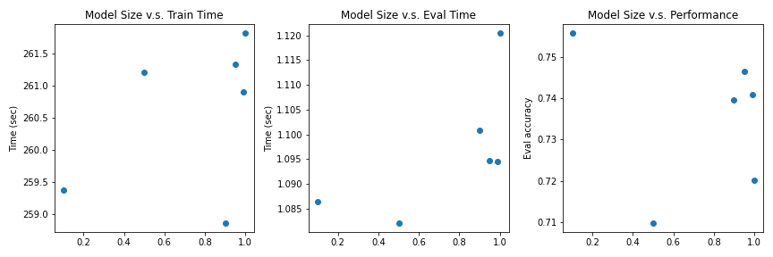
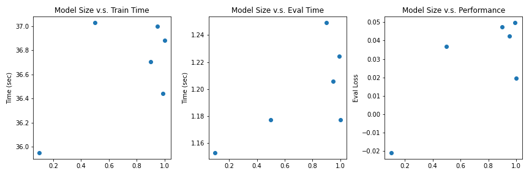
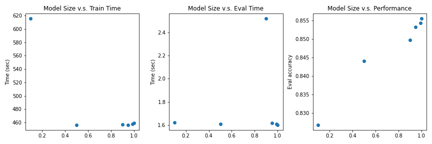
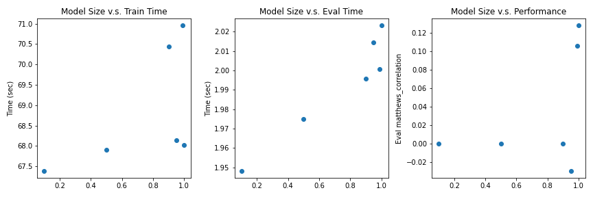
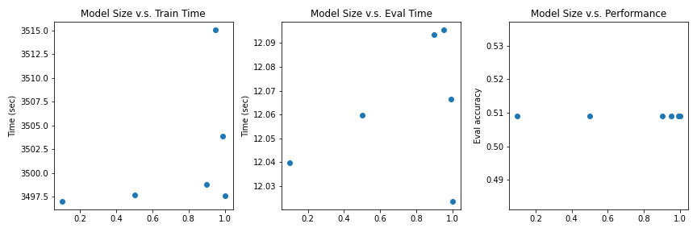
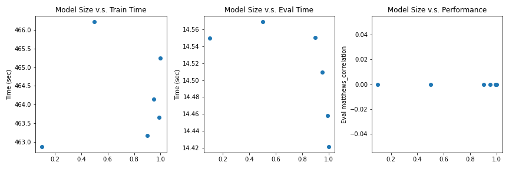

# Report 
## 1. Understanding Concepts
In general, the concepts are all related to the **model compression**, which aims at ***reducing*** the functioning model size to accelerate the training and inference of neural network without incurring a huge cost in its ***accuracy***.

1. *Sparsification*: According to [Mishra et al. 2020](https://arxiv.org/abs/2010.03954), specifications exploit the sparsity present in the weights of the deep model. The weights that are near zero are removed from the weight matrix, which reduces the storage and computation requirements of the deep model.
2. *Pruning*: According to [Mishra et al. 2020](https://arxiv.org/abs/2010.03954), deep model pruning reduces the size of a deep model through the removal of the inadequate components such as channels, filters, neurons, or layers to produce a compact model. 
3. *Quantization*: According to [Deng et al. 2020](https://arxiv.org/abs/2010.03954), quantization attempts to reduce the bitwidth of the data flowing through a neural network, thus it is possible to shrink the model size for memory saving and simplify the operations for compute acceleration.
4. *Distillation*: According to [Mishra et al. 2020](https://arxiv.org/abs/2010.03954), knowledge distillation transfer the generalization ability of the cumbersome teacher model to the compact student model to improve its performance. The student model is trained to mimic the behavior of the teacher model for predicting the class label probabilities.
5. [*MoEfication*](https://aclanthology.org/2022.findings-acl.71/): According to [Zhang et al. 2022](https://aclanthology.org/2022.findings-acl.71/), it ***splits*** the parameters into multiple functioning partitions as experts and build ***expert router*** to adaptively decide which experts will be used for each input. 


## 2. Pick of models
Based on the [OpenBMB](https://openbmb.github.io/BMList/list/) list, the following three models for text processing are picked.
1. Encoder-Only: [GPT-2](https://github.com/openai/gpt-2) (1.5B), I use the GLUE-cola and GLUE-sst2 datasets as the results are available on websites where exact match is used as the metric.
- GLUE performance: https://en.wikipedia.org/wiki/GPT-2#:~:text=Finally%2C%20on%20GLUE%2C%20a%20multi,a%20previous%20record%20of%2068.9).
<!-- - SQUAD performance: https://github.com/ftarlaci/GPT2sQA -->
<!-- 1. Encoder-Only: [GPT-J](https://github.com/kingoflolz/mesh-transformer-jax/#links) (6B), I use the SQUDD and GLUE datasets as the results are available on websites where exact match is used as the metric. It is [reported](https://www.infoq.com/news/2021/07/eleutherai-gpt-j/) to share similar performance as GPT-3. -->
<!-- - GLUE performance: https://en.wikipedia.org/wiki/GPT-2#:~:text=Finally%2C%20on%20GLUE%2C%20a%20multi,a%20previous%20record%20of%2068.9).
- SQUAD performance: https://github.com/ftarlaci/GPT2sQA -->

<!-- 2.  Decoder-Only: [RankGen](https://github.com/martiansideofthemoon/rankgen) (1.3B), I use PA19 and wikipedia dataset as is studied in the original [paper](https://arxiv.org/abs/2205.09726). -->
2.  Decoder-Only: [DeBERTa](https://github.com/microsoft/DeBERTa) (1.5B), I use the GLUE-cola and GLUE-sst2 datasets from the original [paper](https://arxiv.org/abs/1910.10683).

<!-- 3. Encoder-Decoder: [T5](https://github.com/google-research/text-to-text-transfer-transformer#released-model-checkpoints) (3B), I use the SQUDD and GLUE datasets from the original [paper](https://arxiv.org/abs/1910.10683). -->

<!-- 3. Encoder-Decoder: [BlenderBot](https://github.com/google-research/text-to-text-transfer-transformer#released-model-checkpoints) (3B), I use the SQUDD and GLUE datasets from the original [paper](https://arxiv.org/pdf/2004.13637.pdf). -->

3. Encoder-Decoder: [LED](https://github.com/google-research/text-to-text-transfer-transformer#released-model-checkpoints) (1.6B), which is a encoder-decoder variant architecture of BERT. I GLUE-cola and GLUE-sst2 datasets where performance for similar classification and QA tasks are reported in the original [paper](https://arxiv.org/abs/2004.05150).

Note: some GLUE results are shown here: https://gluebenchmark.com/leaderboard.

## 3. Sparsity Structure
<!-- Study the model parameters-->
### Approach to discover Non-zero weights
The non-zero weights are inspected by printing the top-k L1 norm of weights in each layer. The implementation and results are shown in the [notebook](./notebooks/Inspect_Models.ipynb).

### Analysis
Q: what fraction of parameters >> 0? overall? by layer? How does this vary by layer?
In general, the weights of certain linear layers in both attention blocks and forward blocks are >> 0. The bias is generally very small.
By layer, some layers have high weights while others have generally very small weights, with only several certain parameters exceeding 1e-1.


## 4. Sparsification Method
<!-- Explain the adopted method -->
The L1 global unstructured pruning of pytorch is applied to the models. The prune method set the weights with small L1 norm to 0.
```python
# https://spell.ml/blog/model-pruning-in-pytorch-X9pXQRAAACIAcH9h
def prune_model_global_unstructured(model, layer_type, proportion):
    module_tups = []
    for module in model.modules():
        if isinstance(module, layer_type):
            module_tups.append((module, 'weight'))

    prune.global_unstructured(
        parameters=module_tups, pruning_method=prune.L1Unstructured,
        amount=proportion
    )
    for module, _ in module_tups:
        prune.remove(module, 'weight')
    return model
```

## 5. Performance Comparisons
The original implementations and results of experiments on GLUE-sst2 and GLUE-Cola are included in [notebook-sst2](./notebooks/Text%20Classification%20on%20GLUE%20-%20sst2.ipynb) and [notebook-Cola](./notebooks/Text%20Classification%20on%20GLUE%20-%20Cola.ipynb) (HuggingFace Login Required). Here shows the experiment results. The png files are in [.res/](./res/).
1. GPT2 on GLUE-sst2

2. GPT2 on GLUE-Cola

3. DeBERTa on GLUE-sst2

4. DeBERTa on GLUE-Cola

5. LED on GLUE-sst2

6. LED on GLUE-Cola

<!-- ### Performances -->
<!-- ### Model Size v.s. Runtime -->
<!-- Choose two benchmarks -->
<!-- Plot results at 10%, 50%, 90%, 95%, 99% pruning-->
### Discussions
According to the results shown above, in general, the pruning reduces both the training and inference time. At the same time, the pruning slightly reduces the performance of GPT2 and DeBERTa. however, there are also multiple cases violating the trend which will be discussed in the next section. 

Notably, LED failed on both sst2 and Cola, indicating that its strong reliance on its high dimensional decoder troubled its adaptation to these two classification tasks where the outputs are only double-digit and are padded to the 1024D.


## 6. Challenges of sparsification on LLMs
1. ***Additional Complexity.*** Unstructured Pruning adopted in the report requires the hyperparameter to decide the threshold on the L1 norm, which incurs additional difficulty to fine-tune the model. As is shown in the previous section, it is difficult to find a uniform sweet point that offers the best trade-off of performance and efficiency on various models and tasks. Also, it is reported that such unstructured pruning is challenging to be leveraged by hardware and accelerate the training and inference [(Wang et al. 2017)](https://arxiv.org/abs/1910.04732).

2. ***Undesired Loss*** The parameters of pretrained LLM consists of redundant parameter, task-agnostic knowledge, and task-specific knowledge. The objective of pruning and later fine-tuning is to maximumly remove redundant parameters and unrelated task-specific knowledge from the pretraining stage [(Xu et al. 2022)](https://ojs.aaai.org/index.php/AAAI/article/view/21408). However, it is hard to identify and preserve the desired task-specific knowledge and task-agnostic knowledge by simply inspecting the L1 norm. The challenge normally incurs undesired knowledge loss in the pruning stage and poses a challenge to the later fine-tuning stage. Eventually, the model performance could significantly drop as the pruning proportion increase.